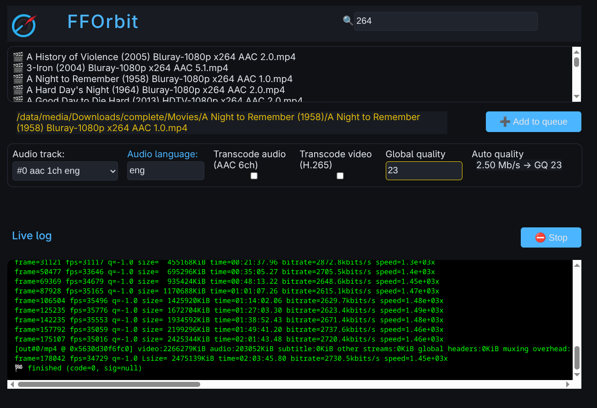
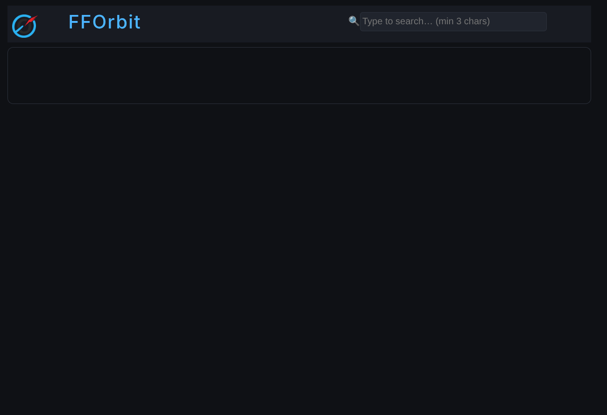
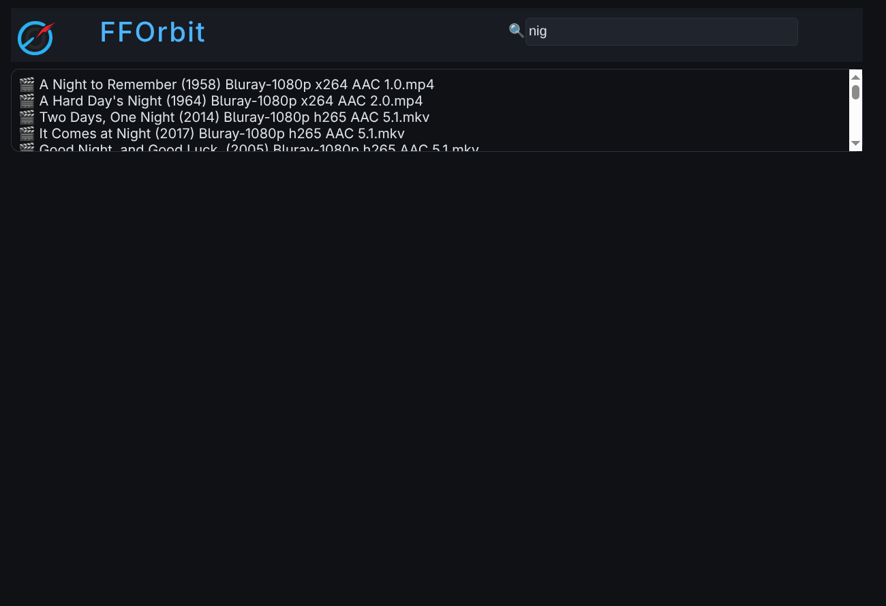
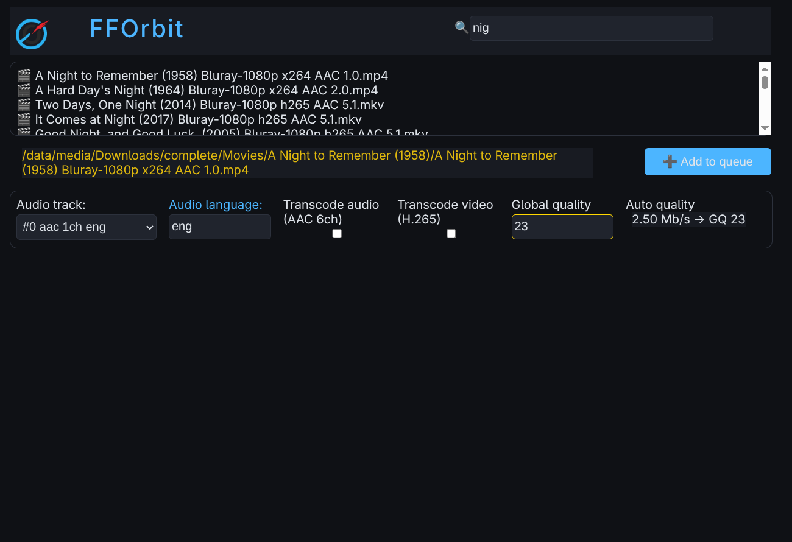
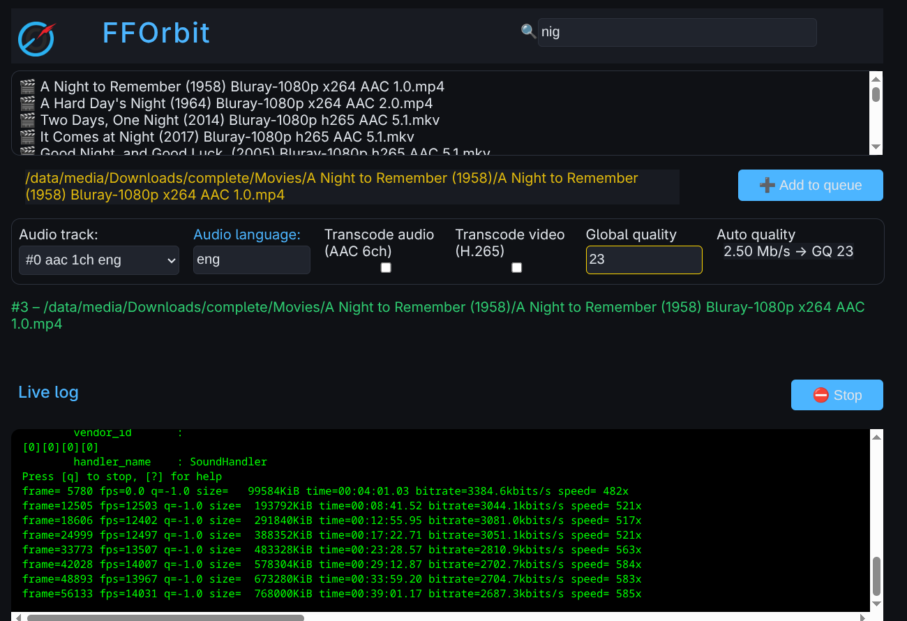

# FFOrbit
Simple FFmpeg web UI inside Jellyfin container, with full hw transcode support.
## Why?
I have a large collection of movies and I have already processed them with a library organizer. Now I'm getting a couple of movies now and then, and first I created a simple batch script to do what I wanted. I used it for over a year and it worked every time. Still, it was a bit tedious to first check if some processing was needed (used Plex), then start the script inside Jellyfin container, then find the movie tabbing on cmd line and finally sometimes it took several attempts to get the file size I wanted. Now FFOrbit solves all these issues with a simple Node js based UI for ffmpeg.

## What does it do?
 With a single pass, it will process the file you choose:
#### Automagically
  - set the movie folder name as metadata title
  - remove all other streams except first video and the audio you choose to keep
#### On your choice
  - keep the audio stream you choose (if many)
  - set audio language code
  - transcode audio (AAC 5.1)
  - transcode video (h265) 
  - set global quality for video transcode (target ~3 Mb/s)

## What does it not do?
FFOrbit isn't meant to be a large volume transcoder. It doesn't (yet) have a fully functioning job queue, so I would not start processing thousands of files with it. 

## Quick start
These examples are for Intel hw. All Jellyfin supported hardware transcoding methods should work, but I haven't been able to test that.
#### Docker
    docker run -d --name fforbit \
      --device /dev/dri:/dev/dri \
      -e TMP_DIR=/mnt/user/media/Downloads/tmp \
      -v /mnt/user/media:/data/media \
      -v /mnt/user/appdata/fforbit:/app/config \
      -p 5002:5002 ghcr.io/velinea/fforbit:latest
#### Docker Compose
services:
  fforbit:
    container_name: fforbit
    devices:
      - /dev/dri:/dev/dri
    environment:
      - TMP_DIR=/mnt/user/media/Downloads/tmp
    volumes:
      - /mnt/user/media:/data/media
      - /mnt/user/appdata/fforbit:/app/config
    ports:
      - 5002:5002
    image: ghcr.io/velinea/fforbit:latest
#### Unraid
## Usage

Go to http://\<local_ip\>:5002

Type search string, after 3 chars you start getting candidates, newest first.

When you click a movie in the pickup list, FFOrbit gives you info about the encoding settings. If there are more than one audio streams, you can pick the one you want to keep and set its language. FFOrbit suggests audio transcode if the file is DTS or FLAC encoded. It suggests video transcode if the video is encoded with anything else than h265 and if the bit rate is reasonably high (>3 Mb/s>). It also suggests Global quality targeting to file size 1-1.5 MB/h.

Start transcode by clicking 'Add to queue' and you see live FFmpeg ouput log below. You can stop the process any time by clicking 'Stop'.
## Notes
- I like to keep TMP_DIR in the same file system as the media, so that after job is complete the file can be just renamed and there is no need to copy it anywhere.
- License: [MIT](https://github.com/velinea/fforbit/blob/main/LICENSE.md)
